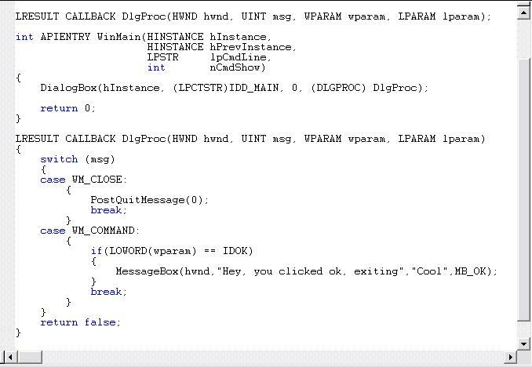



## \_A Great VB to C\+\+ Tutorial\! FINALLY\!\!

### Description

Ok, yes we all love vb. But didn't / don't you want to learn and harness the power of c++? THIS TUTORIAL INCLUES EVERYTHING for starting out from vb to c++. This is a great, authoritive, comprehensive tutorial that shows you C++ side by side using vb code. Six part tutorial that covers everything from syntax to the IDE to 2 types of Win32 window creation. Callback functions, and

over 25 screenshots with the side by side code and tutorials. You should have a pretty good handle on vb, yet it is EXTREMELY EASY to FOLLOW! Comes with source and example code, duplicate programs written in vb and then in c++, shows how to use c++ (WITHOUT CHEEZY MFC) and the REAL Win32 way. Make your own windows with your own classnames, use DialogBox(); Declaring Variables, CALLBACK functions, Fully commented. You may say that you don't need c++, but how do you think the API Dlls are made? Not with VB's ActiveX Dll. You can integrate c++ with VB by writing complex dlls and simply calling them in VB! I Promise you success! ohhh it is so sweet.This will teach you a lot. PLEASE download and vote! Check it out!

KEYWORDS: C++ TUTORIAL VBTOC++ WIN32 Win32 RegisterClass CreateWindow FindWindow CALLBACK Switching Jaime Muscatelli
 
### More Info
 

             |
---                |---
**Submitted On**   |2003-01-17 01:48:04
**By**             |[Jaime Muscatelli](https://github.com/Planet-Source-Code/PSCIndex/blob/master/ByAuthor/jaime-muscatelli.md)
**Level**          |Intermediate
**User Rating**    |4.9 (255 globes from 52 users)
**Compatibility**  |VB 6\.0
**Category**       |[Miscellaneous](https://github.com/Planet-Source-Code/PSCIndex/blob/master/ByCategory/miscellaneous__1-1.md)
**World**          |[Visual Basic](https://github.com/Planet-Source-Code/PSCIndex/blob/master/ByWorld/visual-basic.md)
**Archive File**   |[A\_Great\_VB1530431172003\.zip](https://github.com/Planet-Source-Code/jaime-muscatelli-a-great-vb-to-c-tutorial-finally__1-42500/archive/master.zip)

